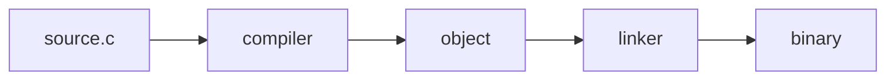
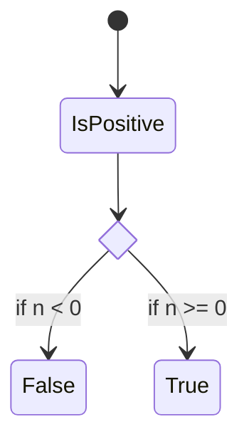

---
defaults:
  layout: two-cols 
mdc: true
fonts:
  mono: Cascadia Mono
  sans: Atkinson Hyperlegible
layout: cover
---

# Authoring in Markdown

---

## Agents Love Plain Text

* Lectures, quizzes, and notes are all markdown in the repo
* Plain text diffs, versions, and edits cleanly
* The agents can read it directly: no copy-paste, no export

::right::

```
  meta/lectures/
    01_introduction.md
    02_transistors.md
    ...
    36_final_review.md
  meta/quizzes/
  meta/lectures/notes/
```

---

## Why Agents Love Plain Text

* No binary format to parse or round-trip
* Every change is a readable line-level diff
* The same file feeds the slides, the PDF, and the agent

::right::

```
  .md  -> slidev   -> slides
  .md  -> pandoc   -> PDF
  .md  -> agent    -> edits
```

---

## Slides Are Markdown

* Slidev turns markdown into a slide deck
  * https://sli.dev/
* One file per lecture, one slide per `---`
* My preferred format: concepts on the left, code or diagram on the right

::right::

```markdown
## Dennis Ritchie's Insight

* Ritchie designed C as portable assembly
* Enough abstraction to leave one machine
* Little enough to still see the hardware

::right::


```

---

## Diagrams, Not Just Bullets

* Favor a diagram or code sample over a wall of text
* Slidev renders `mermaid` blocks and relative images inline
* Ask the agent to draw it, then refine the result

::right::

````markdown

````

---

## Mermaid Diagrams

* Describe the diagram in text; mermaid lays it out for you
* Many types: `flowchart`, `sequenceDiagram`, `stateDiagram`, `classDiagram`
* Edit the source and the picture re-renders -- no drawing tool

::right::



---

## Consistent Style

* The slide rules live in CLAUDE.md, not in your head each time
* The agent applies them to every deck it touches
* Change the rule once and regenerate

::right::

```markdown
* Concepts left, code/media right
* Max three bullets per slide
* No filler slides (no "Pitfalls")
* Cover slide first, summary slide last
* Relative image paths: ./public/...
```

---

## Generating a Deck

* Give a topic and an outline, get a first-draft deck
* It follows your layout, bullet limits, and frontmatter
* First draft is a starting point, not the final cut

::right::

```
  > draft a lecture on linkers,
    follow the lecture rules in
    CLAUDE.md, 12 slides

  -> 20_linkers.md
     cover + 10 + summary + end
```

---

## From Source to Slides

* Hand the agent a reading, a transcript, or rough notes
* Get a first-draft deck in your format
* You still own the cut -- it drafts, you decide

::right::

```
  > turn meta/notes/heap.md into
    a lecture, follow the rules
    in CLAUDE.md, ~12 slides
```

---

## Converting Old Decks

* Migrated Google Slides into slidev with the agent
* Download the deck as a PDF, agent extracts text and images
* Faster than rebuilding, and it lands in your format

::right::

```
  > extract the text and images
    from old_lecture.pdf into a
    slidev deck, follow CLAUDE.md

  Read   old_lecture.pdf
  Write  14_mtmc_overview.md
  Write  public/366/diagram_3.png
```

---

## Revising Slides

* Point at a slide and say what is wrong
* The agent edits that slide, leaves the rest alone
* Small, targeted edits stay reviewable

::right::

```
  > slide 4 has five bullets,
    cut it to three and move the
    code example to the right

  > tighten the summary to
    eight bullets
```

---

## Edit Across Every Lecture

* One instruction can touch all 36 decks at once
* Useful for sweeping style or naming changes
* Review the diff per file before you accept

::right::

```
  > every lecture missing a
    summary slide: add one,
    default layout, eight bullets

  Edit  03_binary_computing.md
  Edit  07_adder_help.md
  ... 9 files changed
```

---

## Curriculum Gap Analysis

* Hand the agent your lectures and a peer syllabus
* Ask what topics you cover that they do not, and the reverse
* Output is a list to judge, not a mandate to follow

::right::

```
  > compare meta/lectures to this
    syllabus, list topics we are
    missing and topics we cover
    that they skip
```

---

## Check the Facts

* The agent writes confident prose, right or wrong
* Verify dates, names, and technical claims yourself
* A clean-looking slide is not a correct slide

::right::

```
  generated:
  "C was released in 1970"

  actual: 1972

  trust nothing you did not check
```

---

## Export to PDF

* `just gen-pdfs` renders every deck to PDF
* Slidev can export a single deck for handouts
* Same markdown source -- no second format to maintain

::right::

```bash
  just gen-pdfs

  # or one deck:
  npx @slidev/cli export \
    20_compilers.md
```

---

## DEMO: Topic to Deck

<!-- Demo: generate a short deck from a one-line topic, then fix two slides live -->

* Generate a short deck from a single-line topic
* Show that it honors the CLAUDE.md rules without restating them
* Fix two slides live and watch the diff

---
layout: default
---

## Summary

* Course materials are markdown in the repo, not binary files
* The same file feeds slidev, pandoc, and the agent
* CLAUDE.md holds the style rules so output stays consistent
* Generated decks are first drafts you revise, not final cuts
* Favor diagrams and code over walls of bullets
* One instruction can edit every lecture at once
* Compare your curriculum to a peer syllabus to find gaps
* Verify the agent's facts -- a clean slide can still be wrong

---
layout: end
---

# Authoring in Markdown